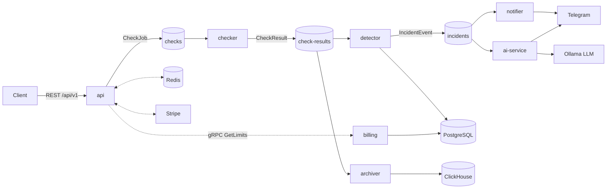

# Uptime — Distributed Uptime Monitoring SaaS

A commercial-style uptime monitoring platform built as an event-driven microservices system in Go. Not a tutorial project — every piece (Kafka, ClickHouse, Redis, gRPC, Stripe, OpenTelemetry) was added to solve a real architectural problem, with the reasoning behind each decision documented as it was made.

## What it does

Users register monitors (URL + check interval). A scheduler dispatches checks, workers probe the URLs, incidents are detected on consecutive failures and pushed to Telegram (with an LLM-generated explanation), and time-series analytics power per-monitor uptime/latency graphs. Plans (free/pro) gate monitor count, check frequency, and API rate limits, enforced via an internal gRPC service and billed through Stripe.

## Architecture



**Key design choice:** `check-results` has two independent consumer groups (`detector`, `archiver`) reading the same topic. Detector owns the critical path (Postgres + incidents); archiver owns analytics (ClickHouse). A dual-write from a single consumer was rejected early — it would have coupled incident detection to ClickHouse availability. Independent consumer groups let Kafka do what it's good at instead.

## Engineering highlights

- **Event-driven core** — six Go services + one Python service communicate over Kafka (KRaft mode), with generic `Publish[T]`/`Consume[T]` wrappers, retry with exponential backoff, and idempotency by key.
- **ClickHouse analytics** — `MergeTree` for raw time-series, `SummingMergeTree` + a materialized view for pre-aggregated hourly rollups, batched writes with a background flush timer (built by hand before reaching for a library).
- **Full Redis pattern set** — cache-aside with TTL, atomic rate limiting via a Lua script (`INCR`+`EXPIRE` in one round trip), distributed locks with token-based safe release (another Lua script — "delete only if it's still my lock"), and event deduplication via `SET NX`.
- **Internal gRPC service** — a `billing` service (protobuf contract via `buf`) is the single source of truth for plan limits; `api` is a generated gRPC client. Limits are enforced on monitor creation, check interval, and — via a Redis-cached lookup — the rate limiter itself.
- **Stripe billing** — Checkout Sessions, webhook signature verification, and idempotent event handling (a duplicate webhook delivery is a documented, expected case, not an edge case).
- **Distributed tracing across an async boundary** — OpenTelemetry spans propagate through *Kafka message headers* (W3C Trace Context), not just HTTP — a single trace follows a check from the scheduler through `checker`, into `detector` and `archiver` in parallel, visible end-to-end in Jaeger.
- **Metrics as code** — Prometheus RED metrics (rate/errors/duration) plus a business gauge (`active_monitors`), with a Grafana dashboard provisioned entirely from JSON in the repo — no manual UI clicks.
- **"Batteries included" Docker Compose** — `make up` boots the entire stack: migrations, Kafka topic creation, and ClickHouse schema init all run as init containers before the services start. Nothing requires a manual setup step.
- **CI** — GitHub Actions runs build, vet, test, and lint on every push.

## Tech stack

| Layer | Technology |
|---|---|
| Language | Go 1.26, Python (LLM explainer) |
| API | Echo, JWT auth |
| Messaging | Apache Kafka (KRaft), franz-go |
| Databases | PostgreSQL (pgx), ClickHouse |
| Cache / coordination | Redis (go-redis) |
| RPC | gRPC + Protocol Buffers (buf) |
| Payments | Stripe (Checkout + Webhooks) |
| Observability | OpenTelemetry, Jaeger, Prometheus, Grafana |
| Infra | Docker Compose, GitHub Actions, k8s |

## Services

| Service | Role |
|---|---|
| `api` | HTTP API, JWT auth, scheduler (publishes check jobs), gRPC client to `billing` |
| `checker` | Probes monitor URLs, publishes results |
| `detector` | Detects incidents from consecutive failures, persists to Postgres |
| `notifier` | Sends Telegram alerts, deduplicated by incident event |
| `archiver` | Batches results into ClickHouse for analytics |
| `billing` | gRPC server; owns plan/subscription data |
| `ai-service` | Python; generates a plain-language incident explanation via a local LLM |

## Getting started

Requires Docker and Docker Compose.

```bash
git clone https://github.com/Bremcm/uptime.git
cd uptime
cp .env.example .env   # fill in Stripe test keys if you want billing to work
make up
```

This starts Postgres, Kafka, Redis, ClickHouse, Jaeger, Prometheus, Grafana, and all seven application services. Migrations, Kafka topics, and the ClickHouse schema are created automatically.

- API: `http://localhost:8080`
- Jaeger UI: `http://localhost:16686`
- Prometheus: `http://localhost:9090`
- Grafana: `http://localhost:3000`

## API overview

- POST /api/v1/auth/register
- POST /api/v1/auth/login
- POST /api/v1/monitors
- GET /api/v1/monitors
- GET /api/v1/monitors/:id/checks
- GET /api/v1/monitors/:id/stats # hourly latency/uptime from ClickHouse
- POST /api/v1/billing/checkout # Stripe Checkout Session
- POST /webhooks/stripe


